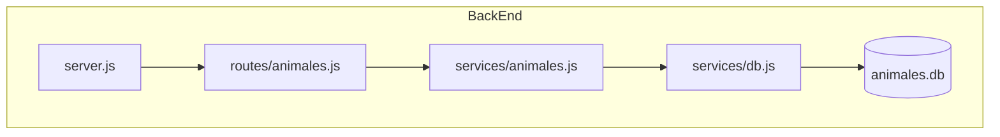

# Guardians Of The Ocean - Hack The Ocean (Backend)

El repositorio del frontend puede visualizarse mediante [este enlace](https://github.com/micheldavrdz/GuardiansOfTheOcean_HackTheOcean_Front).

El despliegue de este aplicativo puede visitarse en el siguiente enlace: [https://animales-api.herokuapp.com/](https://animales-api.herokuapp.com/).

La documentación completa de este proyecto en su totalidad puede ser consultada mediante el [siguiente enlace](https://bit.ly/3yJOCR3).

# Problemática central

Los océanos conforman más del 70% de la superficie de la Tierra, sin embargo, son uno de los hábitats menos investigados por el ser humano. Esto ha provocado que exista una indiferencia hacia la fauna y flora que habita en este lugar, y sobre todo a su conservación y preservación. Actualmente existen cerca de 250,000 especies conocidas que surcan los mares, sin embargo, informes de la Unión Internacional para la Conservación de la Naturaleza estiman que, en la actualidad, se tienen 181 especies marinas que, por desgracia, han desaparecido de la faz de la Tierra; ya sea por cuestiones naturales o por intervención humana, lo cierto es que esta última es la causa en la mayoría de los casos de especies en peligro de sufrir este terrible destino.

# Propuesta de solución

Dado el desconocimiento que existe sobre este hábitat y, por ende, una indiferencia hacia su conservación o incluso aprendizaje, se propone crear un sitio web que proporcione al usuario información relacionada con los animales que actualmente se encuentran en peligro de extinción con el objetivo de enseñar a la vez que se crea conciencia sobre el cuidado y preservación de dichas especies.

# Objetivo del Backend

El servicio de backend tiene como propósito dotar de información al frontend acerca de las diferentes especies marinas en peligro de extinción. Para ello, se propone una base de datos SQLite que contenga información detallada sobre dichas especies, información que estará disponible para su consulta por medio de una REST API que permitirá extraer la información de un animal en específico a la vez.

# Despliegue de la aplicación

1. Clona este repositorio en tu máquina:

`git clone ttps://github.com/AleGV258/GuardiansOfTheOcean_HackTheOcean_Back`

2. Estando dentro de la carpeta, ejecuta el siguiente comando para instalar las dependencias:

`npm install`

3. Por último, ejecuta el servidor con el siguiente comando:

`npm run server`

# Base de datos (SQLite)

El objetivo de la base de datos es almacenar información relacionada con las diferentes especies en peligro de extinción, las cuales serán expuestas por medio de una REST API. Para ello, se propone la siguiente tabla de datos:

La siguiente es una lista de animales que han sido incluidos en dicha base de datos para su consulta por medio de la API (para poder ver toda la información de cada uno de ellos, consultar directamente la API):

- Pez Totoaba
- Tortuga Carey
- Vaquita Marina
- Ballena Azul
- Tortuga Lora
- León Marino de Steller
- Tiburón Martillo Gigante
- Rorcual Común
- Delfín de Cabeza Blanca
- Foca Monje de Hawaii
- Tortuga Verde
- Ajolote Mexicano
- Rana Dorada de Panamá
- Esturión Común
- Anguila Europea
- Tiburón del Ganges
- Trucha Apache
- Atún Rojo del Sur

# REST API

El objetivo de la REST API a desarrollar es la de poner a disposición del Frontend la información contenida en la base de datos sobre los diferentes animales en peligro de extinción, cuyos datos se describieron en el apartado anterior.

1. Dependencias

El desarrollo se hará por medio de NodeJS con ayuda de los siguientes módulos:

| Dependencia | Versión | Uso |
| -- | -- | -- |
| ExpressJS | 4.18.1 | Crear una aplicación web del tipo REST API de manera rápida, minimalista y sencilla |
| BetterSQLite3 | 7.5.1 | Conectar nuestra API (desarrollada con Express) con el gestor de base de datos SQLite3 para la realización de consultas |
| Jest | 28.1.0 | Llevar a cabo pruebas de unidad sobre las diferentes consultas a la base de datos |
| Cors | 2.8.5 | Conectar el Frontend con el Backend (API) para el acceso a los datos dispuestos en esta última |
| Eslint | 8.15.0 | Análisis de sintaxis y estilos dentro del proyecto para que todo quede de manera uniforme |

El objetivo de este apartado y de la creación de la API no solo consiste en proporcionar información al Frontend, sino que se espera que a futuro pueda ser empleado por otros desarrolladores para futuros proyectos que contemplen el mismo marco de referencia.

2. Pruebas de Unidad

Para llevarlo a cabo, se requiere realizar en principio pruebas de unidad que nos permitan corroborar, principalmente, el acceso a la base de datos y el estar recibiendo los datos de manera correcta. Para ello, se proponen las siguientes pruebas de  unidad al servicio Animales.js, el cual se encargará de acceder a la base de datos y realizar las consultas correspondientes (descrito más adelante en la estructura del servidor):

- Acceso a toda la información de la base de datos: Se espera lanzar una petición a la base de datos y recibir un JSON con toda la información contenida en esta. Para corroborarlo, se comprobará su tamaño, el cual debe ser de 10 elementos.
- Acceso a toda la información de un animal en específico (con validación de “Ubicación Preliminar”): Se espera lanzar una consulta a la base de datos y recibir todos los campos de un animal en concreto; para corroborar el haber recibido los datos correctos, se valida que la “ubicación” de este sea la esperada. Animal: Trucha apache, Ubicación preliminar: Arizona, Estados Unidos.
- Acceso a toda la información de un animal en específico (con validación de “Causa de Peligro”): Se espera lanzar una consulta a la base de datos y recibir todos los campos de un animal en concreto; para corroborar el haber recibido los datos correctos, se valida que el “estado de peligro” de este sea el esperada. Animal: Ajolote, Causa de Peligro: Pérdida de hábitat, introducción de peces exóticos, sobreexplotación, contaminación y su consumo como alimento.

3. Estructura del servidor

El desarrollo de esta solución se hará siguiendo la siguiente estructura de proyecto:

# Descripción de cada módulo:

- **server.js:** Servidor principal de la API que recibe las peticiones HTTP.

- **routes/animales.js:** Segunda parte del servidor que aloja la API que contiene los endpoints a emplear en este proyecto, los cuales definimos a continuación:

| Endpoint | Request | Versión |
| -- | -- | -- |
| /HackTheOcean | localhost:3000/HackTheOcean | Se deberá obtener la información de todos los animales con todos sus campos |
| /HackTheOcean/:animal | localhost:3000/HackTheOcean/:animal | Se deberá obtener toda la información del animal especificado en el request (por medio del nombre de este) |

- **services/animales.js:** Servicio que nos provee de funciones cuyo objetivo es realizar consultas SQL a la base de datos. Contiene dos funciones que acceden a la DB y devuelven la información solicitada por los dos endpoints de la API (este módulo es el que se testea en las Pruebas de Unidad)

- **services/db.js:** Servicio que se conecta con la base de datos que contiene la información de los animales y realiza la consulta proporcionada por el módulo anterior.

# Pruebas del funcionamiento del Backend

Se corrobora el primer endpoint de la REST API, el cual devuelve toda la información contenida en la base de datos sobre los animales:

Y por último, se corrobora el segundo endpoint, el cual permite extraer toda la información únicamente del animal que se haya solicitado en la petición por medio de la URL. Ejemplo: `http://localhost:3000/HackTheOcean/Ajolote%20Mexicano`

Para corroborar el funcionamiento de la API, se proporciona la siguiente colección de Postman: [HackTheOcean.zip](https://github.com/AleGV258/GuardiansOfTheOcean_HackTheOcean_Back/files/8694514/HackTheOcean.zip)

# Escalabilidad

Se busca que la base de datos pueda ser actualizada con nuevas especies por medio de nuevos endpoints que permitan el manejo del gestor de base de datos. Para ello, se buscaría dotar a la plataforma de usuarios autorizados que pudieran realizar dichas consultas.

Esto con el objetivo de que la REST API pueda ser pública y de libre acceso para cualquiera que requiera de dicha información, ya que se trata de datos reales y crudos sobre la realidad que vive la naturaleza marina actualmente, y que podrían servir para crear conciencia en los demás por medio de otros productos, es decir, que no se quede solo en nuestro sitio web.
